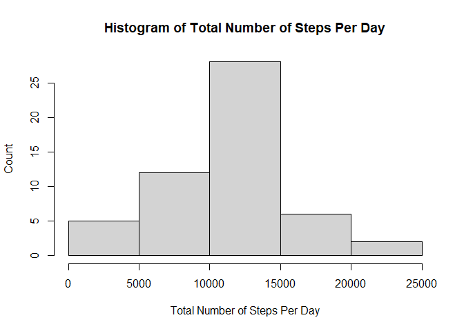
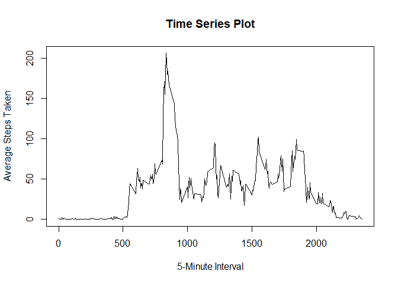
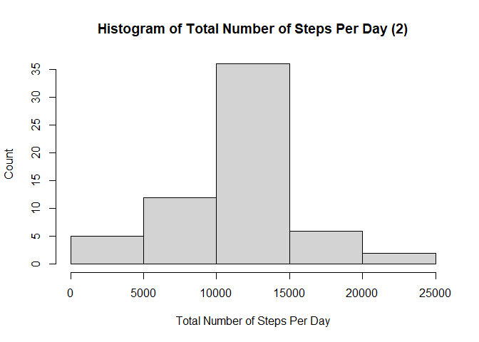
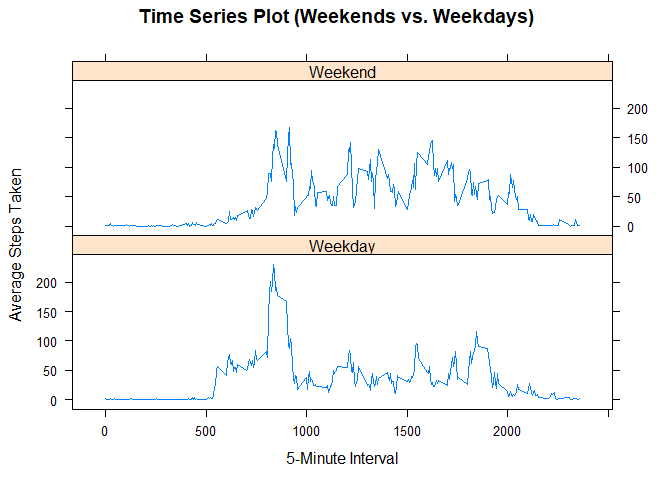

# Loading and preprocessing the data


```r
setwd("C:/Users/Corson/Desktop/Coursera/Rep Research")

df <- read.csv("activity.csv")
```

# Here we transform the data into suitable formats.  In particular we transform the date variable into date format.


```r
df$date <- as.Date(df$date)
```

# What is mean total number of steps taken per day?
  1. Calculate the total number of steps taken per day.
  2. Make a histogram of the total number of steps taken each day.
  3. Calculate and report the mean and median of the total number of steps taken per day.
  

```r
TotalSteps <- with(df,tapply(steps,date,FUN=sum))

hist(TotalSteps, main = "Histogram of Total Number of Steps Per Day", 
     xlab = "Total Number of Steps Per Day", ylab = "Count")
```

<!-- -->

```r
meanTotalSteps <- mean(TotalSteps, na.rm = TRUE)
medianTotalSteps <- median(TotalSteps, na.rm = TRUE)
```

The mean steps taken per day is 1.0766189\times 10^{4} and the median steps taken per day is 10765. 

# What is the average daily activity pattern?
  1. Make a time series plot of the 5-minute interval (x-axis) and the average number of steps taken, averaged across all days (y-axis).
  2. Which 5-minute interval, on average across all the days in the dataset, contains the maximum number of steps?


```r
AvePer5Min <- aggregate(steps~interval,data=na.omit(df),mean)

plot(AvePer5Min$steps ~ AvePer5Min$interval, type = "l", 
     main = "Time Series Plot",
     xlab = "5-Minute Interval",
     ylab = "Average Steps Taken")
```

<!-- -->

```r
MaxInterval <- with(AvePer5Min, interval[which.max(steps)])
```

The 5 minute interval that contains the highest average number of steps is 835.

# Imputing missing values
  1. Calculate and report the total number of missing values in the dataset.
  2. Devise a strategy for filling in all of the missing values in the dataset.
  3. Create a new dataset that is equal to the original dataset but with the missing data filled in.
  4. Make a histogram of the total number of steps taken each day and Calculate and report the mean and median total number of steps taken per day. Do these values differ from the estimates from the first part of the assignment? What is the impact of imputing missing data on the estimates of the total daily number of steps?
  

```r
MissingValues <- sum(is.na(df$steps))
```

The total number of NAs in the dataset is 2304.


```r
df2 <- df

for (i in 1:nrow(df2)){
  if (is.na(df2$steps[i])) {
    dummyint <- df2[i,]$interval
    df2$steps[i] <- AvePer5Min[which(AvePer5Min$interval == dummyint), "steps"]
  }  
}
```

```r
TotalSteps2 <- with(df2,tapply(steps,date,FUN=sum))

hist(TotalSteps2, main = "Histogram of Total Number of Steps Per Day (2)", 
     xlab = "Total Number of Steps Per Day", ylab = "Count")
```

<!-- -->

```r
meanTotalSteps2 <- mean(TotalSteps2)
medianTotalSteps2 <- median(TotalSteps2)
```

After inputing the missing values, the mean steps taken per day is 1.0766189\times 10^{4} and the median steps taken per day is 1.0766189\times 10^{4}.  The mean number of steps is unchanged from when we calculated it previously.  The median number of steps changed a little and is equal to the mean.  When we calculated the mean above we omitted the NAs.  Since we replaced the NAs with an average of a subset of values, it didn't affect the new calculated mean which should be expected.  In recalculating the median, however, the imputed values resulted in a new value.

# Are there differences in activity patterns between weekdays and weekends?
  1. Create a new factor variable in the dataset with two levels – “weekday” and “weekend” indicating whether a given date is a weekday or weekend day.
  2. Make a panel plot containing a time series plot of the 5-minute interval (x-axis) and the average number of steps taken, averaged across all weekday days or weekend days (y-axis).
-

```r
df2$day <- weekdays(df2$date)

df2$daytype <- "NA"

for (i in 1:nrow(df2)){
  if (df2$day[i] == "Saturday" | df2$day[i] == "Sunday"){
    df2[i,]$daytype <- "Weekend"
  } else {
    df2[i,]$daytype <- "Weekday"
  }
}

AvePer5Min2 <- aggregate(steps~interval + daytype, data=df2, mean)

library(lattice)

xyplot(AvePer5Min2$steps ~ AvePer5Min2$interval | AvePer5Min2$daytype, 
       layout = c(1, 2), type = "l", 
       main = "Time Series Plot (Weekends vs. Weekdays)", 
       xlab = "5-Minute Interval", ylab = "Average Steps Taken")
```

<!-- -->
